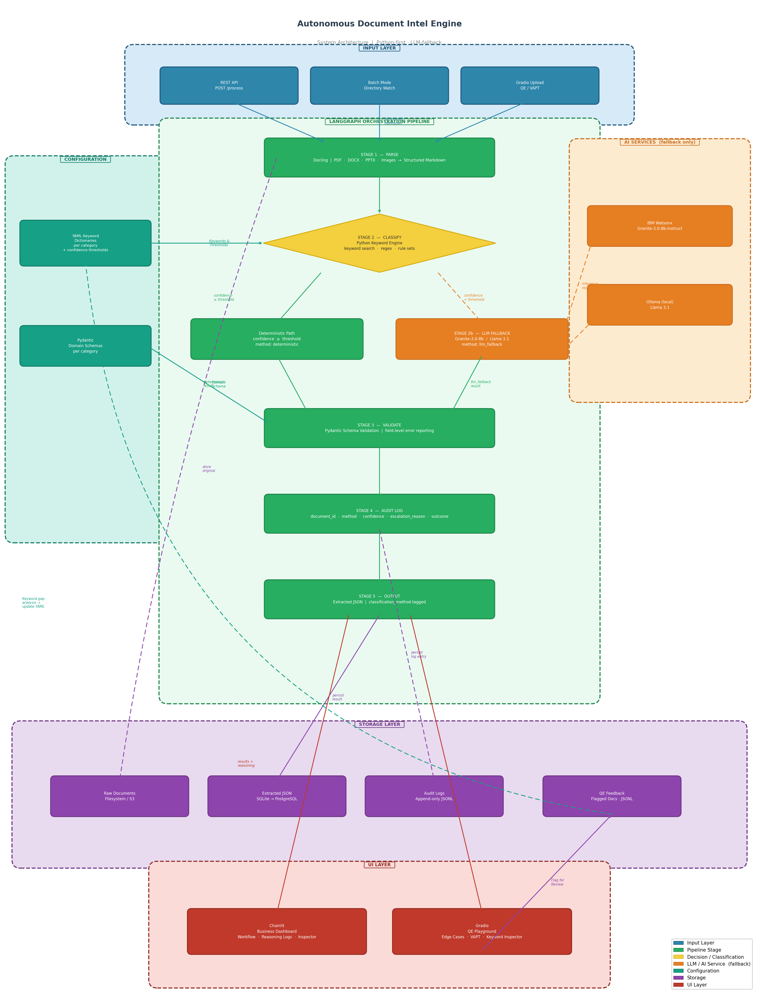

# Architecture: Autonomous Document Intel Engine

## Diagram



> Vector version (scales without loss): [architecture.svg](architecture.svg)
>
> To regenerate after edits:
> ```bash
> # from the project root
> .venv/Scripts/python docs/generate_architecture.py   # Windows
> .venv/bin/python     docs/generate_architecture.py   # macOS / Linux
> ```
> Dependencies: `pip install matplotlib` (no external binaries required)

---

## Layer Summary

| Layer | Components | Role |
|-------|-----------|------|
| **Input** | REST API, Directory Watch, Gradio Upload | Document entry points |
| **Pipeline** | LangGraph (Docling → Keyword Engine → LLM Fallback → Pydantic → Audit) | End-to-end stateful processing |
| **AI Services** | IBM Watsonx (Granite-3.0-8b), Ollama (Llama 3.1) | LLM fallback only — not the primary path |
| **Configuration** | YAML Keyword Dictionaries, Pydantic Schemas | Drives deterministic classification — version controlled |
| **Storage** | Filesystem/S3, SQLite/PostgreSQL, JSONL logs | Persists documents, results, audit trail, and QE feedback |
| **UI** | Chainlit (stakeholders), Gradio (QE/security) | Transparency dashboard and validation harness |

---

## Key Design Decisions

| Decision | Rationale |
|----------|-----------|
| Python keyword search is the **primary** classifier | Deterministic, auditable, zero LLM cost for the common case |
| LLM is invoked **only** below confidence threshold | Caps inference cost at < 20% of document volume |
| Every output is tagged with `classification_method` | Full traceability — stakeholders know whether a rule or an LLM made the call |
| Audit log is **append-only** | Immutable paper trail for compliance and dispute resolution |
| QE feedback loop targets **keyword dictionaries** | Improves deterministic coverage over time; no model retraining required |
| Graceful LLM degradation (`llm_unavailable` flag) | System remains operational if Watsonx/Ollama is unreachable |
